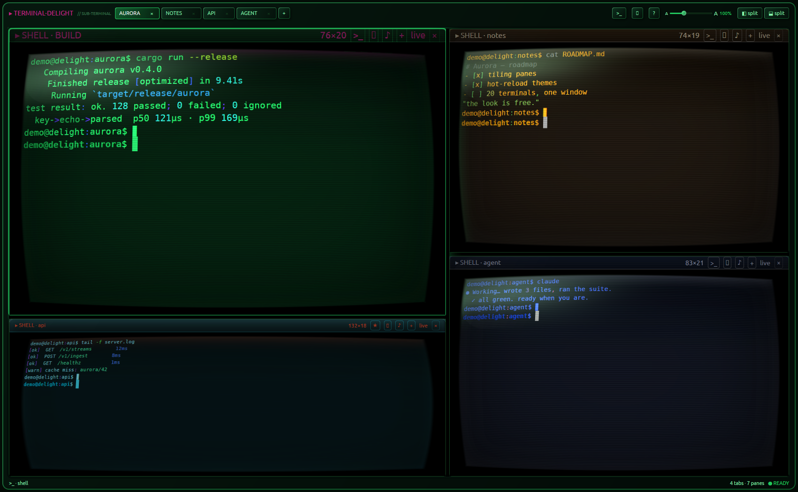
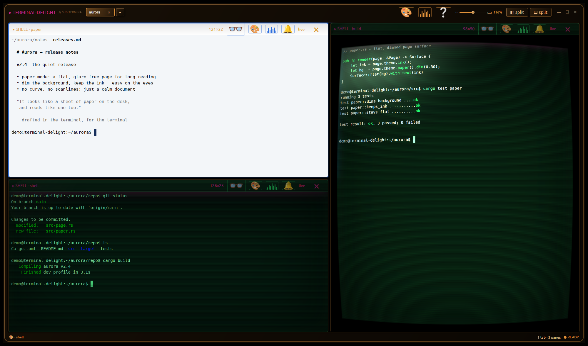

# terminal-delight

A **GPU-native Linux terminal** with a hot-reloadable, CRT-flavored visual identity.
Rust end-to-end: [gpui](https://github.com/zed-industries/zed/tree/main/crates/gpui)
(Zed's GPU UI framework) renders everything; [`alacritty_terminal`](https://docs.rs/alacritty_terminal)
does the VT emulation; your real shell runs on a real PTY.

> Goal: **2-5-20 terminals in one window · native-snappy · web-app polished ·
> modify-at-will themes · open source.** See [docs/PLAN.md](docs/PLAN.md) for the
> gated build plan (all five G0 risk gates + MVP 0.1: **passed**).



<p align="center"><em>One window, many real shells — each pane its own tube, theme, and curvature.</em></p>

> Screenshots use staged demo content (a throwaway home + fake prompt), never a real shell.

**Platform:** Linux only (X11 & Wayland, via gpui's wgpu renderer). Not macOS/Windows.

## Status — 0.1 (multi-pane tiling terminal)

| Capability | State |
|---|---|
| Real shells (PTY + full VT emulation) — bash, vim, top, tmux verified | ✅ |
| Tiling-tree splits + tabs, per-pane grids, focus borders | ✅ |
| `ctrl+alt+r` / `ctrl+alt+d` split · `alt+←/→` switch panes · sub-tab drag-to-split · window pop-out | ✅ |
| Pane closes when its shell exits; last one quits the app | ✅ |
| Layout + per-pane appearance restore on launch | ✅ |
| Live resize → SIGWINCH (verified against `tput`) | ✅ |
| Full ANSI color (16 themed + 256 + truecolor), bold/underline/inverse/dim | ✅ |
| Scrollback (wheel), mouse selection (click/word/line), `ctrl+shift+c/v`, bracketed paste | ✅ |
| **Hot-reload themes** — edit `~/.config/terminal-delight/theme.toml`, no restart | ✅ |
| 4 built-in themes + live-editable `custom`; picker with hover captions/tooltips | ✅ |
| Per-pane appearance: theme & monitor-OSD **grade** groups inherit the workspace independently, each with a live "follow outer" toggle | ✅ |
| Monitor-OSD tray: brightness/contrast/colour/text/background/gamma **+ text size**, global or per-pane | ✅ |
| **Agent panes** (claude/codex): your own messages get their own colour (👤 wheel pip) + `Alt+↑/↓` / ▲▼ to jump between them | ✅ |
| CRT-lite effects: scanlines, vignette, glow — per-theme dials, fully off in light theme | ✅ |
| Latency probe (`TD_LATENCY=1`): key→echo→parsed **p50 121µs / p99 169µs**; `seq 1 100000` in **0.089s** | ✅ |

## Install

**Prebuilt AppImage (x86_64):** grab `terminal-delight-x86_64.AppImage` from the
[latest release](https://github.com/parker-brown-family/terminal-delight/releases),
then:

```bash
chmod +x terminal-delight-x86_64.AppImage
./terminal-delight-x86_64.AppImage
```

It's a single self-contained file and **MIT-licensed** (see [License](#license)).
Graphics drivers (Vulkan/OpenGL, Wayland/X11) are used from your system, like any
native app. The optional agent-finished **bell** plays through your system
`ffplay` (install `ffmpeg` to hear it) and stays silent if it's absent; the
PD/CC0 default sounds are bundled and seeded on first run.

## Build from source

```bash
# deps (Ubuntu): bash scripts/setup-deps.sh   (Vulkan + build libs)
bash scripts/prepare-gpui.sh   # clone pinned Zed + apply the td patches
cd app && cargo run
```

gpui is consumed from a pinned Zed checkout
(`abbe85a3321bf6cb7f5b241e623d9c2e16c29187`, post-wgpu-Linux-renderer) carrying
two small patches (`docs/patches/`): `0001-td-crt-pass` (the per-pane CRT barrel
warp) and `0002-sever-gpl-crates` (removes the GPL crates the Zed graph would
otherwise link — see [License](#license)). `scripts/prepare-gpui.sh` sets the
checkout up as a sibling `zed-upstream/` directory and applies both; CI does the
same. The crates.io gpui release still ships the older blade renderer with known
NVIDIA/X11 issues.

Build the AppImage yourself, or run the full pre-release smoke:

```bash
bash scripts/build-appimage.sh    # → dist/terminal-delight-x86_64.AppImage
bash scripts/release-smoke.sh     # fmt + clippy + tests + deny + AppImage check
```

## Theming — edit while it runs

First launch seeds `~/.config/terminal-delight/theme.toml` (hacker). Change any value —
colors, the 16 ANSI slots, `scanline_opacity`, `vignette`, `glow`, font — and the running
app picks it up in ~300ms. Four themes ship in [`app/themes/`](app/themes/):
**hacker** (phosphor green) · **tactical-overdrive** (cyan) · **field-command** (olive) ·
**quiet-command** (light, effects off). Copy one over your config file to switch.



## Architecture

```
app/src/main.rs   Workspace: panes, split/focus/close, layout persistence
app/src/pane.rs   TerminalView: grid render (styled runs), input→PTY bytes,
                  selection, scrollback, clipboard, CRT-lite, latency probe
app/src/term.rs   the seam: alacritty_terminal tty+EventLoop (clean-room, Apache-2.0 API)
app/src/theme.rs  TOML themes, hot-reload watcher, gpui Global
app/src/warp.rs   per-pane warp registry feeding the td-crt-pass renderer patch
app/themes/       shipped themes (data files — the no-Rust contribution path)
docs/PLAN.md      the adversarially-hardened plan, gates G0a–G0e + milestones
index.html, src/  original browser design prototype (kept as design reference)
```

## License

terminal-delight's own source is **MIT** (see `LICENSE`), and so are its
distributed binaries. Every linked dependency is used under a permissive license
(MIT / Apache-2.0 / BSD-class) — the binary carries **no copyleft obligations**.

This took one deliberate move. The pinned Zed graph *would* otherwise pull three
**GPL-3.0-or-later** crates (`ztracing`, `zlog`, `ztracing_macro`) into the linked
binary via `gpui -> sum_tree` — they were only used for trace spans and a test
logger. `docs/patches/0002-sever-gpl-crates.patch` removes those uses and drops
the dependencies, so they never reach the binary. With that edge severed, a
*distributed* build is cleanly MIT-compatible, which is what makes the prebuilt
AppImage redistributable. The full third-party license bundle is generated by
[`cargo about`](app/about.toml) and shipped inside each AppImage (and in
[`THIRD-PARTY-LICENSES.md`](THIRD-PARTY-LICENSES.md)).

`cargo deny check` enforces this with **no GPL exceptions** (`app/deny.toml`) — any
newly-introduced copyleft dependency fails CI. CI also runs formatting, strict
Clippy, tests, the release build, an advisory audit, and (on push) builds the
AppImage. The clean-room rule for Zed reference is in docs/PLAN.md §2.

### Privacy

terminal-delight records each pane's working directory and agent resume command
(`claude --resume <id>` / `codex resume <id>`) to `~/.config/terminal-delight/state.toml`
so it can reopen your work after a restart. That file is written owner-only
(`0600`); delete it to clear the history.

## Roadmap

**Shipped since 0.1** — tabs · tiling-tree splits (well past 5 panes) · sub-tab
drag-to-split + window pop-out (the 0.3 detach goal) · the **true post-process CRT
shader** (the 0.4 wgpu barrel-warp pass — PLAN R1's fork gate, now landed) ·
**MIT-clean prebuilt AppImage** (0.2 packaging) · portability hardening (vendor-
agnostic GPU setup, explicit font fallback + startup GPU/font diagnostics, X11
PRIMARY-selection copy).

**Next** — Flatpak alongside the AppImage · broader Linux matrix (AMD/Intel ·
Wayland · fractional scaling) · 20-pane stress + rigorous latency rig vs Alacritty ·
a theme gallery. See [docs/PLAN.md](docs/PLAN.md) for the gated plan.
