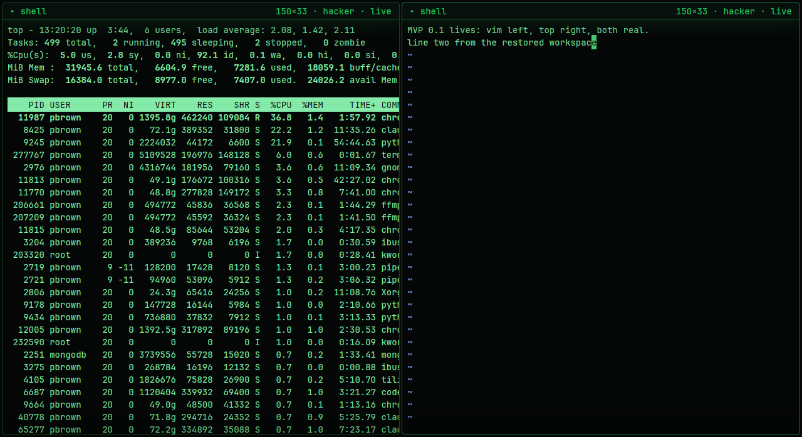

# terminal-delight

A **GPU-native Linux terminal** with a hot-reloadable, CRT-flavored visual identity.
Rust end-to-end: [gpui](https://github.com/zed-industries/zed/tree/main/crates/gpui)
(Zed's GPU UI framework) renders everything; [`alacritty_terminal`](https://docs.rs/alacritty_terminal)
does the VT emulation; your real shell runs on a real PTY.

> Goal: **2-5-20 terminals in one window · native-snappy · web-app polished ·
> modify-at-will themes · open source.** See [docs/PLAN.md](docs/PLAN.md) for the
> gated build plan (all five G0 risk gates + MVP 0.1: **passed**).



**Platform:** Linux only (X11 & Wayland, via gpui's wgpu renderer). Not macOS/Windows.

## Status — 0.1 (multi-pane tiling terminal)

| Capability | State |
|---|---|
| Real shells (PTY + full VT emulation) — bash, vim, top, tmux verified | ✅ |
| Tiling-tree splits + tabs, per-pane grids, focus borders | ✅ |
| `ctrl+alt+r` / `ctrl+alt+d` split · `alt+←/→` switch panes · sub-tab drag-to-split · window pop-out | ✅ |
| Pane closes when its shell exits; last one quits the app | ✅ |
| Layout + per-pane appearance restore on launch | ✅ |
| Live resize → SIGWINCH (verified against `tput`) | ✅ |
| Full ANSI color (16 themed + 256 + truecolor), bold/underline/inverse/dim | ✅ |
| Scrollback (wheel), mouse selection (click/word/line), `ctrl+shift+c/v`, bracketed paste | ✅ |
| **Hot-reload themes** — edit `~/.config/terminal-delight/theme.toml`, no restart | ✅ |
| 4 built-in themes + live-editable `custom`; picker with hover captions/tooltips | ✅ |
| Per-pane appearance: theme & monitor-OSD **grade** groups inherit the workspace independently, each with a live "follow outer" toggle | ✅ |
| Monitor-OSD tray: brightness/contrast/colour/text/background/gamma **+ text size**, global or per-pane | ✅ |
| CRT-lite effects: scanlines, vignette, glow — per-theme dials, fully off in light theme | ✅ |
| Latency probe (`TD_LATENCY=1`): key→echo→parsed **p50 121µs / p99 169µs**; `seq 1 100000` in **0.089s** | ✅ |

## Build & run

```bash
# deps (Ubuntu): bash scripts/setup-deps.sh   (Vulkan + build libs)
bash scripts/prepare-gpui.sh   # clone pinned Zed + apply the td-crt-pass patch
cd app && cargo run
```

gpui is consumed from a pinned Zed checkout
(`abbe85a3321bf6cb7f5b241e623d9c2e16c29187`, post-wgpu-Linux-renderer) carrying
the `td-crt-pass` renderer patch (`docs/patches/0001-td-crt-pass.patch`) — the
per-pane CRT barrel warp. `scripts/prepare-gpui.sh` sets the checkout up as a
sibling `zed-upstream/` directory; CI does the same. The crates.io gpui release
still ships the older blade renderer with known NVIDIA/X11 issues.

Release smoke:

```bash
bash scripts/release-smoke.sh
```

## Theming — edit while it runs

First launch seeds `~/.config/terminal-delight/theme.toml` (hacker). Change any value —
colors, the 16 ANSI slots, `scanline_opacity`, `vignette`, `glow`, font — and the running
app picks it up in ~300ms. Four themes ship in [`app/themes/`](app/themes/):
**hacker** (phosphor green) · **tactical-overdrive** (cyan) · **field-command** (olive) ·
**quiet-command** (light, effects off). Copy one over your config file to switch.

## Architecture

```
app/src/main.rs   Workspace: panes, split/focus/close, layout persistence
app/src/pane.rs   TerminalView: grid render (styled runs), input→PTY bytes,
                  selection, scrollback, clipboard, CRT-lite, latency probe
app/src/term.rs   the seam: alacritty_terminal tty+EventLoop (clean-room, Apache-2.0 API)
app/src/theme.rs  TOML themes, hot-reload watcher, gpui Global
app/src/warp.rs   per-pane warp registry feeding the td-crt-pass renderer patch
app/themes/       shipped themes (data files — the no-Rust contribution path)
docs/PLAN.md      the adversarially-hardened plan, gates G0a–G0e + milestones
index.html, src/  original browser design prototype (kept as design reference)
```

## License

terminal-delight's own source is **MIT** (see `LICENSE`). It links `gpui` and
`alacritty_terminal`, both **Apache-2.0**.

**This is a source-only project — please do not redistribute prebuilt binaries.**
The pinned Zed graph pulls **GPL-3.0-or-later** crates (`ztracing`, `zlog`,
`ztracing_macro`) into the linked binary through `gpui -> sum_tree`, so a
*distributed binary* is a derivative work that would have to ship under
GPL-3.0-or-later. The source tree stays cleanly MIT precisely because those GPL
crates are never redistributed here — you build them yourself from your own Zed
checkout via `scripts/prepare-gpui.sh`. Relicensing to GPL-3.0-or-later, or
severing the `sum_tree -> ztracing` edge in the fork, is what would unlock MIT
binaries later.

`cargo deny check` enforces this license/source policy (`app/deny.toml`), and CI
also runs formatting, strict Clippy, tests, the release build, and an advisory
audit. The clean-room rule for Zed reference is in docs/PLAN.md §2.

### Privacy

terminal-delight records each pane's working directory and agent resume command
(`claude --resume <id>` / `codex resume <id>`) to `~/.config/terminal-delight/state.toml`
so it can reopen your work after a restart. That file is written owner-only
(`0600`); delete it to clear the history.

## Roadmap

**0.2** tabs · up to 5 panes · drag splitters · packaging smoke test (AppImage/Flatpak) ·
**0.3** detach pane → own window · **0.4** true post-process CRT shader (wgpu pass — fork
gate per PLAN R1) · **1.0** 20 panes · rigorous latency rig vs Alacritty · theme gallery.
