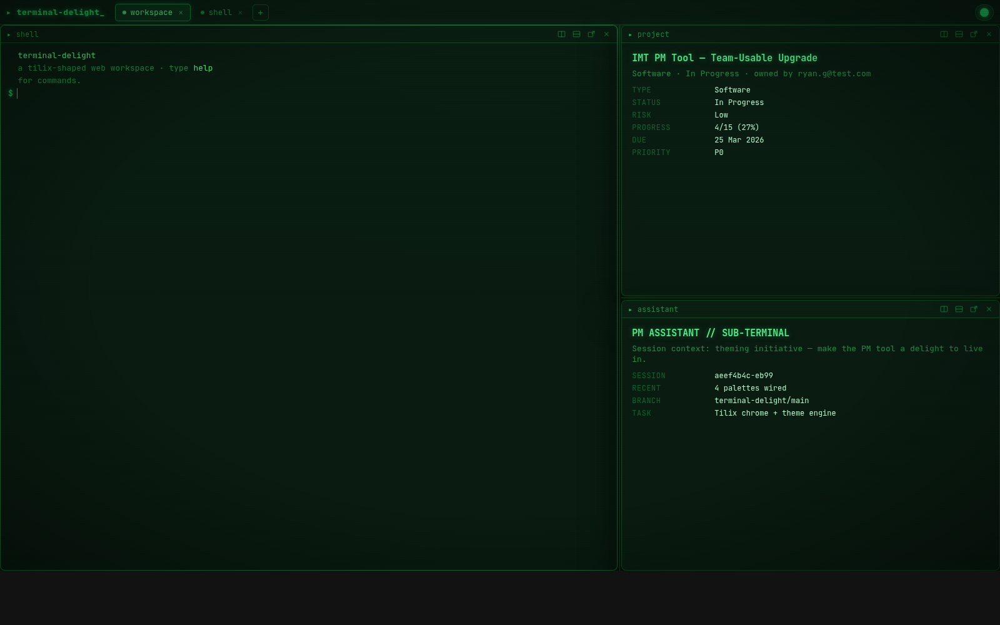

# terminal-delight

A **Tilix-shaped web workspace** wearing a **themeable phosphor-green CRT** look.
Tabs, split panes, draggable dividers, and drag-a-pane-out-to-break-it-into-a-window —
all running at compositor speed, with a 4-theme × any-seed-colour selector lifted from
the IMT PM engine.

> The "impossible trilemma" — *look gorgeous · run like Tilix · be fully themeable* —
> is actually one token-driven system plus one discipline (compositor-only effects).



## Run

```bash
npm run dev          # python3 -m http.server 4322  (zero deps)
# or:  npm run dev:vite
```
Open <http://localhost:4322>. Deep-link a theme: `?theme=tactical-overdrive&seed=%2331d7ff`.

No build step. Pure ES modules + CSS custom properties.

## What works today

| Behaviour | Status |
|---|---|
| Tabs — add / close / **drag-reorder** / double-click-rename | ✅ |
| Tiling — **split-right / split-down**, recursive binary tree | ✅ |
| **Draggable splitters** (live resize) | ✅ |
| Per-pane **triple-button** (split-right · split-down · detach) + close | ✅ |
| **Drag a pane header off the tiling area → breaks out into its own window** | ✅ |
| Detach button → pop-out window, theme-synced via `BroadcastChannel` | ✅ |
| **Theme selector**: hacker / tactical-overdrive / field-command / quiet-command | ✅ |
| **Seed-colour** picker → whole palette derived via HSL math | ✅ |
| UI-scale slider, localStorage persistence | ✅ |
| Faux terminal panes (`help`, `ls`, `neofetch`, `echo`, …) | ✅ |

## Architecture

Three theming tiers (see `src/styles/theme.css`):

1. **seed palette** — `theme-engine.js` runs a seed hex through HSL math → `--theme-*` vars.
2. **semantic tokens** — each `html[data-theme=…]` maps those to `--bg / --surface / --text / --accent …`.
3. **effect dial** — `--scanline-opacity / --glow-radius / --crt-vignette`. `hacker` turns them up; `quiet-command` to zero. **Same engine, different dial.**

Switching themes swaps one attribute — no re-render, no rebuild. The CRT overlay is a
single fixed, GPU-composited `body::after` layer that never repaints.

```
index.html            workspace chrome + theme-menu markup (data-* contract)
popout.html           standalone broken-out pane
src/styles/theme.css  tokens + the 4 themes + effect dial
src/styles/workspace.css  tabs, tiling, splitters, triple-button, CRT overlay
src/js/theme-engine.js    seed→palette, selector, BroadcastChannel sync  (ported from IMT)
src/js/workspace.js       tab + tiling-tree engine, splitters, detach gesture
src/js/panes.js           pane content factories (terminal / panel / assistant)
src/js/detach.js          break-out → window.open(popout)
```

## Roadmap

- **base16/base24 adoption** — express the 4 palettes as [tinted-theming](https://github.com/tinted-theming/tinty)
  schemes so 250+ community themes plug in for free, and ours become portable to terminals.
- Real terminals via **xterm.js** in leaf panes (PTY over WebSocket).
- Persist & restore layouts (serialize the node tree).
- Drag a pane *onto* another to swap/move within the tree.

## License

MIT.
