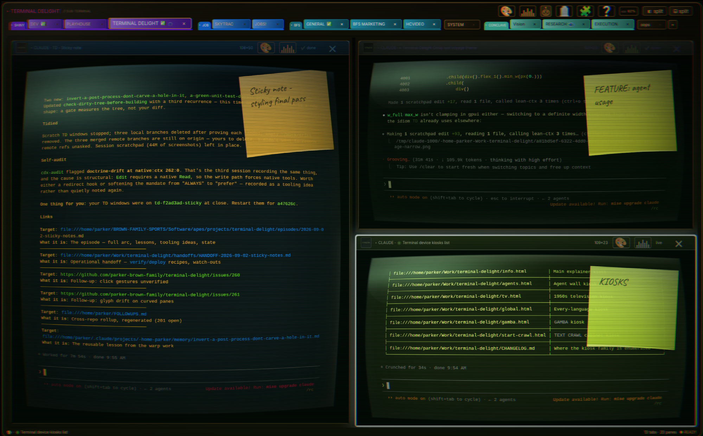
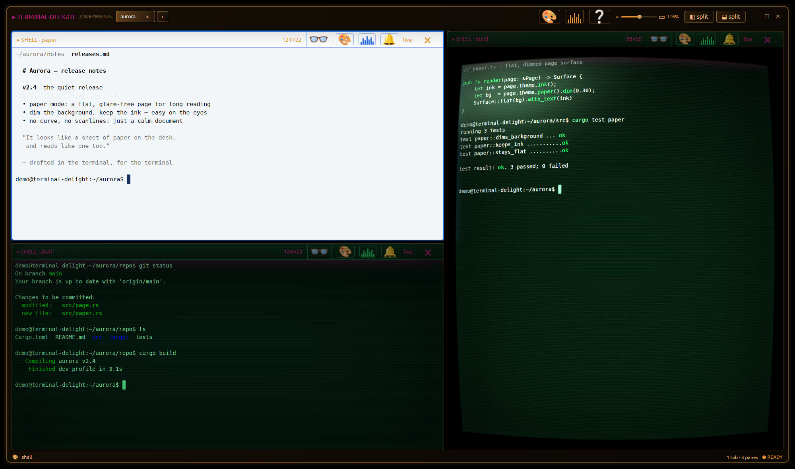

# terminal-delight

A **GPU-native Linux terminal** with a hot-reloadable, CRT-flavored visual identity.
Rust end-to-end: [gpui](https://github.com/zed-industries/zed/tree/main/crates/gpui)
(Zed's GPU UI framework) renders everything; [`alacritty_terminal`](https://docs.rs/alacritty_terminal)
does the VT emulation; your real shell runs on a real PTY.

> Goal: **2-5-20 terminals in one window · native-snappy · web-app polished ·
> modify-at-will themes · open source.** See [docs/PLAN.md](docs/PLAN.md) for the
> gated build plan (all five G0 risk gates + MVP 0.1: **passed**).



<p align="center"><em>One window, twenty real shells — each pane its own tube, theme, and curvature, and every agent on the wall visible from the tab strip.</em></p>

> Screenshots use staged demo content (a throwaway home + fake prompt), never a real shell.

**What's in that shot:**

- **Sticky notes.** Press a note onto any pane and write on it — what this shell
  is for, what you were mid-way through, what to check when you get back. It
  sticks to the pane, rides the barrel warp with it, and survives a restart.
  Peel it off when it's done.
- **The agent wall — now with subscription usage.** The one surface that steers
  TD collapses to a wall of agent cards, and a `</>` card face reports how much
  of each AI coding subscription is spent and when the window rolls over
  (Claude Code, Codex, Fireworks). TD collects nothing itself: a per-vendor
  collector publishes one JSON record and the panel reads the directory, so
  adding a subscription is a plugin, not a patch. On Omarchy the records are
  already being written for its agents widget and TD picks them up for free.
- **Agent status lives in the tab strip.** Every tab shows a badge per agent
  under it — the robot *breathing* while it works, a yellow HEY blinker when it
  needs you (that outranks everything: the turn is yours), ✅ on a clean finish,
  ❌ when it hit a wall. You never open a tab to find out whether anything is
  happening in it.
- **System notifications when an agent finishes or asks.** The toast goes out
  through `notify-send`, so it's any freedesktop desktop, not just Omarchy —
  Omarchy just renders it through Quickshell. Title is `tab → pane` so you know
  where to look, the body is a recap of the agent's own last words pulled from
  its transcript, and clicking the toast zips straight to that pane. Nothing
  fires if you were already watching it finish.
- **An MCP server for the window itself.** Agents get a real handle on the pane
  layer: `list_panes` (who is running where, mode, cwd, session), `pane_events`
  (tail another agent's tool calls), and `get_pane_config` / `set_pane_config`
  (brightness, contrast, colour, warp, text size, crawl — in plain percents).
  Appearance only: nothing there can write bytes to a PTY. See
  [docs/mcp.md](docs/mcp.md).
- **`grep` across *every* open terminal.** One case-insensitive substring
  search over the recent scrollback of all exposed panes at once, answering
  with the pane's identity and the matching lines. Find the error, the path,
  the value — anywhere in a twenty-pane window — without hunting tab by tab.

**Platform:** Linux only (X11 & Wayland, via gpui's wgpu renderer). Not macOS/Windows.

## Status — 0.1 (multi-pane tiling terminal)

| Capability | State |
|---|---|
| Real shells (PTY + full VT emulation) — bash, vim, top, tmux verified | ✅ |
| Tiling-tree splits + tabs, per-pane grids, focus borders | ✅ |
| `alt+v` / `alt+h` (or `ctrl+alt+r` / `ctrl+alt+d`) split · `alt+←/→` switch panes · sub-tab drag-to-split · window pop-out | ✅ |
| Pane closes when its shell exits; last one quits the app | ✅ |
| Layout + per-pane appearance restore on launch | ✅ |
| Per-directory default logos — pick once, inherited by subdirs, persistent (`dir-logos.toml`) | ✅ |
| Live resize → SIGWINCH (verified against `tput`) | ✅ |
| Full ANSI color (16 themed + 256 + truecolor), bold/underline/inverse/dim | ✅ |
| Scrollback (wheel), mouse selection (click/word/line), `ctrl+shift+c/v`, bracketed paste | ✅ |
| **Hot-reload themes** — edit `~/.config/terminal-delight/theme.toml`, no restart | ✅ |
| 4 built-in themes + live-editable `custom`; picker with hover captions/tooltips | ✅ |
| Per-pane appearance: theme & monitor-OSD **grade** groups inherit the workspace independently, each with a live "follow outer" toggle | ✅ |
| Monitor-OSD tray: brightness/contrast/colour/text/background/gamma **+ text size**, global or per-pane | ✅ |
| **Agent panes** (claude/codex): your own messages get their own colour (👤 wheel pip) + `Alt+↑/↓` / ▲▼ to jump between them | ✅ |
| **Sticky notes** — a written note pinned to a pane, warped with it, restored on launch | ✅ |
| **Per-agent tab badges** — working / needs-you / done / blocked, without opening the tab | ✅ |
| **Desktop notifications** (`notify-send`) on finish or question, with a transcript recap; click to jump to the pane | ✅ |
| **MCP server** — `list_panes` · `pane_events` · `get_pane_config` / `set_pane_config` · `grep` across every open pane | ✅ |
| **Subscription usage** on the agent wall, fed by per-vendor collectors (no collection in TD) | ✅ |
| CRT-lite effects: scanlines, vignette, glow — per-theme dials, fully off in light theme | ✅ |
| Latency probe (`TD_LATENCY=1`): key→echo→parsed **p50 121µs / p99 169µs**; `seq 1 100000` in **0.089s** | ✅ |

## Install

**Prebuilt AppImage (x86_64):** download `terminal-delight-x86_64.AppImage` from the
[latest release](https://github.com/parker-brown-family/terminal-delight/releases/latest),
then:

```bash
chmod +x terminal-delight-x86_64.AppImage
./terminal-delight-x86_64.AppImage
```

It's a single self-contained file and **MIT-licensed** (see [License](#license)).
Graphics drivers (Vulkan/OpenGL, Wayland/X11) are used from your system, like any
native app. The optional agent-finished **bell** plays through your system
`ffplay` (install `ffmpeg` to hear it) and stays silent if it's absent; the
PD/CC0 default sounds are bundled and seeded on first run.

## Build from source

```bash
# deps (Ubuntu): bash scripts/setup-deps.sh   (Vulkan + build libs)
bash scripts/prepare-gpui.sh   # clone pinned Zed + apply the td patches
cd app && cargo run
```

gpui is consumed from a pinned Zed checkout
(`abbe85a3321bf6cb7f5b241e623d9c2e16c29187`, post-wgpu-Linux-renderer) carrying
a five-patch stack (`docs/patches/`, ~1,080 lines): `0001-td-crt-pass` (the
per-pane CRT barrel warp), `0002-focus-blur`, `0003-text-crawl`, and
`0004-warp-tube-cap-32` (focus/effect hooks), plus `0002-sever-gpl-crates`
(removes the GPL crates the Zed graph would otherwise link — see
[License](#license)). `scripts/prepare-gpui.sh` sets the checkout up as a
sibling `zed-upstream/` directory and applies all five; CI does the same. The
crates.io gpui release still ships the older blade renderer with known
NVIDIA/X11 issues.

Build the AppImage yourself, or run the full pre-release smoke:

```bash
bash scripts/build-appimage.sh    # → dist/terminal-delight-x86_64.AppImage
bash scripts/release-smoke.sh     # fmt + clippy + tests + deny + AppImage check
```

## Theming — edit while it runs

First launch seeds `~/.config/terminal-delight/theme.toml` (hacker). Change any value —
colors, the 16 ANSI slots, `scanline_opacity`, `vignette`, `glow`, font — and the running
app picks it up in ~300ms. Four themes ship in [`app/themes/`](app/themes/):
**hacker** (phosphor green) · **tactical-overdrive** (cyan) · **field-command** (olive) ·
**quiet-command** (light, effects off). Copy one over your config file to switch.



## Omarchy / Hyprland integration — send a tile to Terminal Delight

`scripts/install-send-hotkey.sh` installs `td-send` and binds **SUPER+ALT+T**:
focus any terminal tile (foot, Alacritty, kitty, Ghostty, `org.omarchy.*`) and
the session migrates into a Terminal Delight pane — idle shells re-open at
their cwd, `claude`/`codex` agents resume by session id, tmux attaches
re-attach. Anything else in the foreground (vim, htop…) is refused and nothing
is closed. With no adoptable TD window running, a fresh one is seeded to
receive the session. `td-send --dry-run` prints the plan without touching
anything, and `--uninstall` on the installer reverts the binding.

Runtime dependencies (checked by the scripts, which fail with a message):

- **Hyprland** (`hyprctl`) — window addressing and close dispatches; both the
  ≥0.56 Lua dispatcher and the legacy string form are spoken
- **jq** — JSON plumbing in `td-send` and the hook/installer scripts
- `omarchy-notification-send` — optional; notifications are skipped without it
- the hotkey installer writes Omarchy's `o.bind(…)` helper into
  `~/.config/hypr/bindings.lua`; on plain (non-Omarchy) Hyprland, bind it
  yourself: `bind = SUPER ALT, T, exec, td-send`
- `plugins/td-send` (the `td-send-mcp` MCP server that exposes
  `pull_workspace` / `send_window` to agents) needs `python3`, stdlib only

The Rust side (the `ctl adopt` verb and `terminal-delight probe`) adds no new
crate dependencies.

### The rest of it lives in two sibling repos

The terminal is the app. The look it wears, and the desktop that wears it back,
are separate projects on purpose — you can take one without the others.

| Repo | What it is |
|---|---|
| [**terminal-delight**](https://github.com/parker-brown-family/terminal-delight) | the terminal itself — GPU-native, Rust, tiling panes, per-pane grading |
| [**omarchy-terminal-delight-theme**](https://github.com/parker-brown-family/omarchy-terminal-delight-theme) | the desktop half — the Omarchy theme, the variant set, the compositor curve, and `td-tint` |
| [**omarchy-td-palette**](https://github.com/parker-brown-family/omarchy-td-palette) | *Terminal Paint* — the 🎨 bar widget that raises the picker over every terminal tile on the workspace |

The seam between them is `td-tint`, which ships with the theme: it writes a
variant's OSC palette down another terminal's tty and puts the matching
gradient on its window border. That is how foot, Alacritty, kitty and Ghostty
get the same one-click identity Terminal Delight panes have — and why the
palette widget can paint a whole workspace without any of those terminals
knowing this project exists.

## Architecture

```
app/src/main.rs   Workspace: panes, split/focus/close, layout persistence
app/src/pane.rs   TerminalView: grid render (styled runs), input→PTY bytes,
                  selection, scrollback, clipboard, CRT-lite, latency probe
app/src/term.rs   the seam: alacritty_terminal tty+EventLoop (clean-room, Apache-2.0 API)
app/src/theme.rs  TOML themes, hot-reload watcher, gpui Global
app/src/warp.rs   per-pane warp registry feeding the td-crt-pass renderer patch
app/src/bell.rs   per-pane agent-finished bell (sound pick/trim, ffplay playback)
app/src/notify.rs desktop toast: transcript recap, tab → pane title, click-to-jump
app/src/sticky.rs the note stuck to a pane — text, placement, persistence
app/src/usage.rs  reads per-vendor subscription-usage records (TD collects none)
app/src/mcp.rs    the MCP server: list_panes, pane_events, pane config, grep
app/themes/       shipped themes (data files — the no-Rust contribution path)
docs/PLAN.md      the adversarially-hardened plan, gates G0a–G0e + milestones
index.html, src/  original browser design prototype (kept as design reference)
```

## License

terminal-delight's own source is **MIT** (see `LICENSE`), and so are its
distributed binaries. Every linked dependency is used under a permissive license
(MIT / Apache-2.0 / BSD-class) — the binary carries **no copyleft obligations**.

This took one deliberate move. The pinned Zed graph *would* otherwise pull three
**GPL-3.0-or-later** crates (`ztracing`, `zlog`, `ztracing_macro`) into the linked
binary via `gpui -> sum_tree` — they were only used for trace spans and a test
logger. `docs/patches/0002-sever-gpl-crates.patch` removes those uses and drops
the dependencies, so they never reach the binary. With that edge severed, a
*distributed* build is cleanly MIT-compatible, which is what makes the prebuilt
AppImage redistributable. The full third-party license bundle is generated by
[`cargo about`](app/about.toml) and shipped inside each AppImage (and in
[`THIRD-PARTY-LICENSES.md`](THIRD-PARTY-LICENSES.md)).

`cargo deny check` enforces this with **no GPL exceptions** (`app/deny.toml`) — any
newly-introduced copyleft dependency fails CI. CI also runs formatting, strict
Clippy, tests, the release build, an advisory audit, and (on push) builds the
AppImage. The clean-room rule for Zed reference is in docs/PLAN.md §2.

### Privacy

terminal-delight records each pane's working directory and agent resume command
(`claude --resume <id>` / `codex resume <id>`) to `~/.config/terminal-delight/state.toml`
so it can reopen your work after a restart. That file is written owner-only
(`0600`); delete it to clear the history.

## Roadmap

**Shipped since 0.1** — tabs · tiling-tree splits (well past 5 panes) · sub-tab
drag-to-split + window pop-out (the 0.3 detach goal) · the **true post-process CRT
shader** (the 0.4 wgpu barrel-warp pass — PLAN R1's fork gate, now landed) ·
**MIT-clean prebuilt AppImage** (0.2 packaging) · portability hardening (vendor-
agnostic GPU setup, explicit font fallback + startup GPU/font diagnostics, X11
PRIMARY-selection copy).

**Next** — Flatpak alongside the AppImage · broader Linux matrix (AMD/Intel ·
Wayland · fractional scaling) · 20-pane stress + rigorous latency rig vs Alacritty ·
a theme gallery. See [docs/PLAN.md](docs/PLAN.md) for the gated plan.
