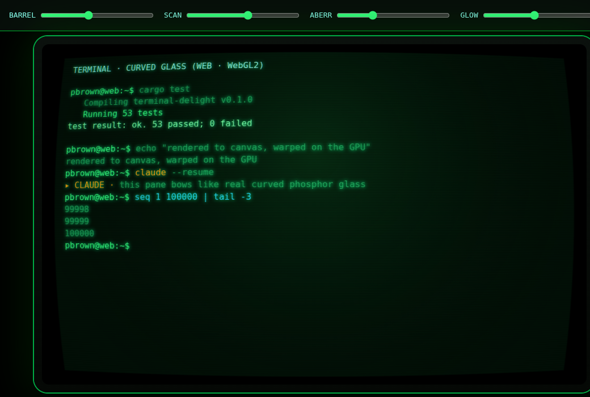
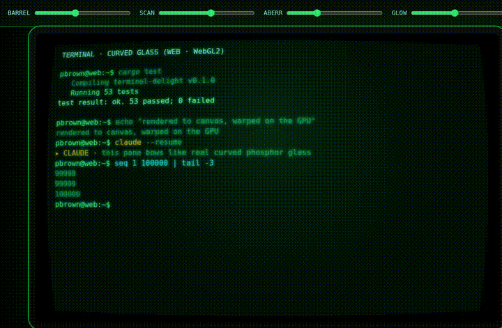
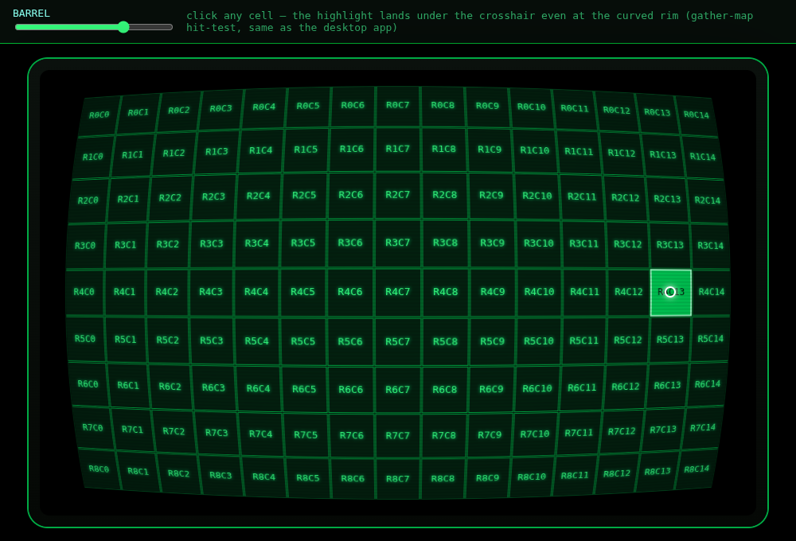
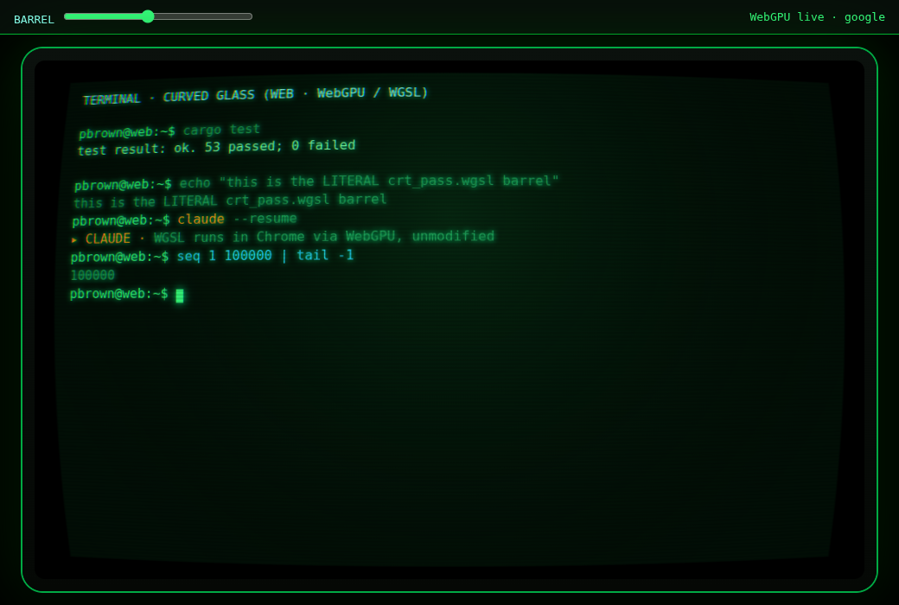
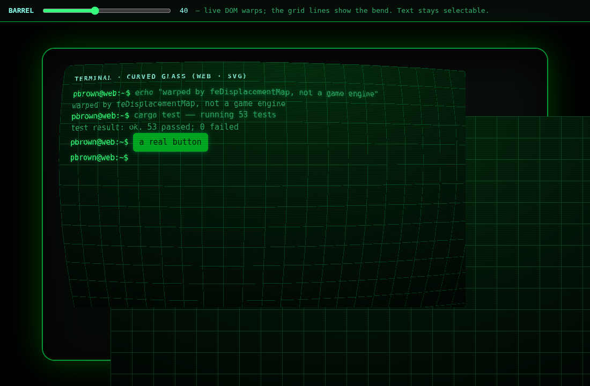
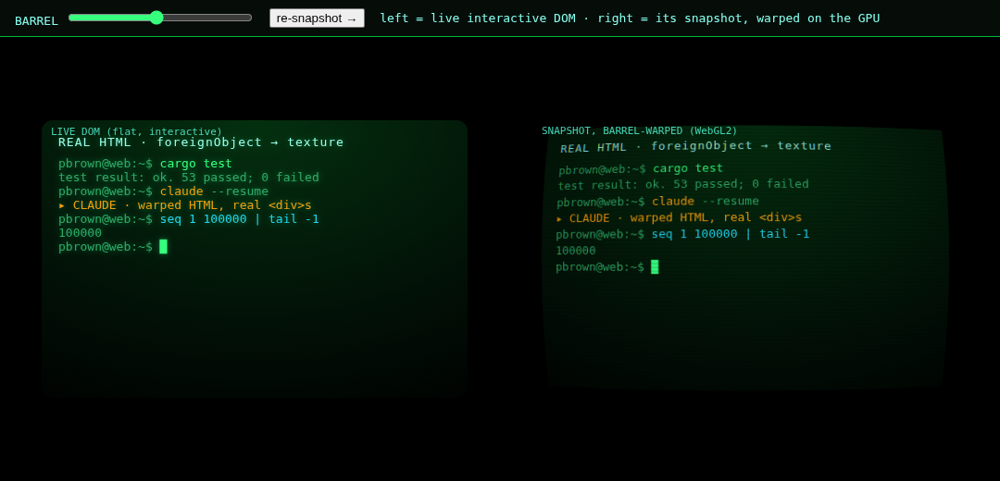
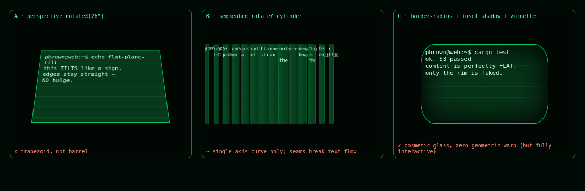

# Barrel CRT warp on the web — YES, and here's how 🟢🛢️

**Verdict: the terminal-delight curved-glass barrel warp is absolutely doable on the
web — at 60fps, pixel-accurate, and even *click-correct under the curve*.** No Unity,
no game engine. The one real constraint is *what content* you warp (live arbitrary DOM
is hard; a canvas-rendered terminal is trivial). Six approaches built and screenshot-
verified in Chrome 145. Full detail + perf + references in **[RESEARCH_LOG.md](RESEARCH_LOG.md)**.

---

## ★ The answer for a terminal: render to canvas, warp on the GPU (Approach 03)
Live, animated, 60fps, ~zero dependencies. This is what should replace the static
`crt-wall.png` hero on the site.

**Live curvature sweep (video):** [shots/03-warp-sweep.mp4](shots/03-warp-sweep.mp4) · 

## ★ It's also *click-correct under the warp* (Approach 05)
Clicking the strongly-curved rim selects the cell that's **visually under the cursor**
(white crosshair = pointer, bright cell = selection) — using the exact same gather-map
as the desktop `warp_screen_to_content`. A web terminal that's warped AND interactive.

## The literal desktop shader, in the browser (Approach 04 · WebGPU/WGSL)
Bit-exact parity — the same WGSL barrel runs in Chrome via WebGPU.

## Warping real, live DOM (Approach 01 · SVG feDisplacementMap)
The *only* way to bend live, selectable HTML. Grid lines bow; text stays selectable.
Caveat: the browser hit-tests the un-warped geometry, so keep the curve gentle.

## Warping arbitrary HTML via snapshot (Approach 02 · foreignObject → WebGL)
Left = live interactive DOM · right = its GPU-warped snapshot. Good for a hero that
updates rarely (font/CORS caveats apply).

## What CSS *cannot* do (Approach 06)
Perspective tilts (trapezoid, no bulge); a sliced cylinder bends one axis and breaks
text; border-radius+shadow is cosmetic. CSS does the bezel/vignette, never the warp.

---

## TL;DR recommendation
| Use case | Ship | Why |
|----------|------|-----|
| **Marketing hero** | **03 (WebGL2)**, +04 (WebGPU) as enhancement | live curved-CRT hero, 60fps, ~0 deps |
| **Interactive web terminal** | **05 (canvas + gather hit-test)** | warped *and* click-correct |
| **Warp foreign live DOM** | **01 (SVG)**, gentle curve | only live-DOM option; or HTML-in-Canvas (Chromium 147+) |
| Rust→WASM | skip (unless 1 shader source) | warp is ~40 lines GLSL; wasm = 1–3MB naga |

**Performance:** could not break Approach 03 — locked 60fps to 4K-supersampled, ~50×
GPU headroom at 1080p. The warp pass is free; only DOM-snapshot upload is costly (so
render glyphs straight to canvas).

*Built in the `td-web-warp` worktree on branch `experiment/web-barrel-warp`. Not committed.*
